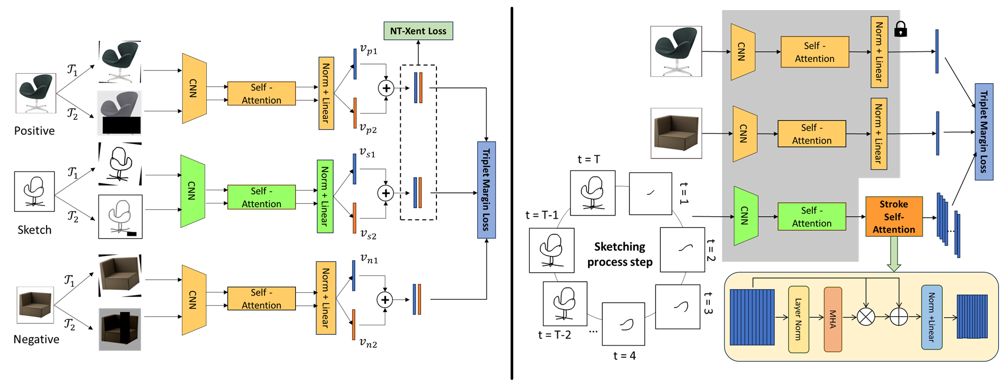

# On-the-Fly Fine-Grained Sketch-Based Image Retrieval with Dual-Channel Contrastive Learning and Stroke Self-Attention 

Tuan Nguyen Huu, Long Dang Hoang, Phuong Tu Minh

## Abstract

Fine-grained Sketch-Based Image Retrieval (FG-SBIR) is the task of retrieving a specific photo instance given a free-hand human sketch as the query. In this paper, we consider the on-the-fly FG-SBIR framework, in which partial sketches are used as queries and the goal is to retrieve the target photo with the least number of strokes. This task faces two key challenges: (1) the large visual gap between sketches and photos, which requires learning cross-domain invariant representations, and (2) the drawing styles vary across users, making it necessary to properly capture the relationships among strokes, while ignoring the order of drawing them. To address these challenges, we propose DC-SSA, a two-stage framework combining \textbf{D}ual-\textbf{C}hannel Contrastive Learning and \textbf{S}troke \textbf{S}elf-\textbf{A}ttention mechanism. The first stage learns robust cross-domain representations for photos and sketches using two channels with geometric and photometric augmentations and two types of contrastive loss. The second stage captures semantic relationships among strokes via a self-attention mechanism, which effectively models relationships without relying on drawing order. Experiments on QMUL-Chair-V2 and QMUL-Shoe-V2 show that DC-SSA achieves up to 20\% higher m@B and 15\% higher wm@B than the best previous model. Ablation studies confirm that both stages significantly boost early retrieval performance, establishing a new state-of-the-art for on-the-fly FG-SBIR.


Illustration of our method’s capability to retrieve the target photo (top-10 list) with fewer strokes compared to SOTA methods such as RL-B, MGAL, LGRL and PSRL. The term T denotes the number of strokes.

## Framework

(1) Phase 1 – FG-SBIR model based on Augmented-view contrastive, using NT-Xent Loss and Triplet Margin Loss. (2) The Stroke Self-Attention is used to learn the relational features among incomplete strokes. The weights of the other part are frozen

## Datasets
QMUL-Shoe-V2 and QMUL-Chair-V2 dataset was used.

## Checkoint
Our pretrained models on two datasets was published in: [Hugging Face](https://huggingface.co/TuanNguyenHuu/ASSA_model/tree/main) 

## Tutorial
Step 1: You must clone the repository and install important libraries

```
!git clone https://github.com/huutuan1705/assa.git
cd assa
!pip install -r requirements.txt
```

Step 2: Run main code

If you want to run baseline code:

- With 200 epochs first:
```
!python main_baseline.py --dataset_name ChairV2 --root_dir <Your dataset dir> --save_dir <Your dir that you want to save checkpoint>
```
- With next 200 epochs:
```
!python main_baseline.py --dataset_name ChairV2 --root_dir <Your dataset dir> --save_dir <Your dir that you want to save checkpoint> --lr 0.00001 --alpha <set your number you want> --pretrained_dir <The pretrained dir of 200 epochs first>
```

If you want to run Stroke Self-Attention phase:
- With 200 epochs first:
```
!python main_sketch.py --dataset_name ChairV2 --root_dir <Your dataset dir> --save_dir <Your dir that you want to save checkpoint>
```
- With next 200 epochs:
```
!python main_sketch.py --dataset_name ChairV2 --root_dir <Your dataset dir> --save_dir <Your dir that you want to save checkpoint> --lr 0.00001 --pretrained_dir <The pretrained dir of 200 epochs first>
```

## Ciatation
If you find this article useful in your research, please consider citing:

```
@inproceedings{tuannh2026sketch,
  title={Augmented-view contrastive and Stroke Self-Attention for On-The-Fly Fine-Grained SBIR},
  author={Tuan Nguyen Huu and Long Dang Hoang and Anh Nguyen Thi Tu and Phuong Tu Minh},
  year={2026}
}
```